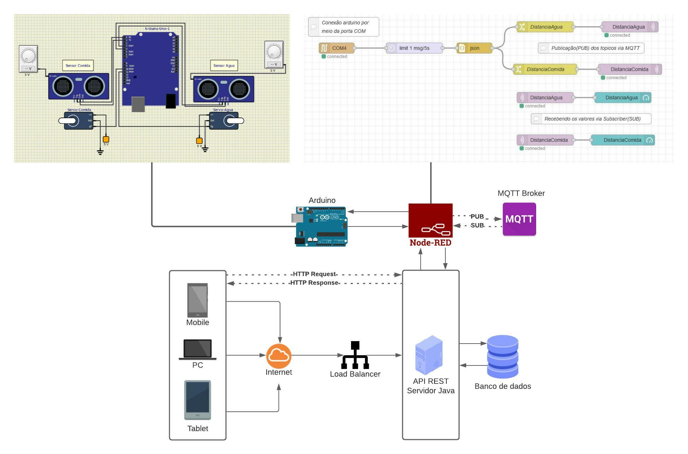

# Projeto Smart Feed para Pets

Projeto de alimentador automático para pets, desenvolvido para a matéria de Enterprise Application Development, do curso de Análise e Desenvolvimento de Sistemas da FIAP.

**Nome dos alunos:**

- João Paulo Pereira Macêdo - RM: 86353
- Karen Martins Silveira - RM: 85282
- Lucas Pelosi de Almeida - RM: 85987
- Mariana Alves de Oliveira Ribeiro - RM: 86125
- Tiago de Brito Ferreira - RM: 84267
- Vitor Mendes Olivério - RM: 84609

**Turma:** 2TDSG

**Ano:** 2021

## Problema encontrado

Segundo Feitosa(F. L. F. 2014. Semiologia veterinária: A arte do diagnóstico. Grupo Gen-Editora Roca Ltda., São Paulo.), a OBESIDADE acomete entre 20 a 40% da população animal, acarretando aos seus portadores várias disfunções na fisiologia dos sistemas orgânicos quais sejam: cardiovascular, imunológico, osteoarticular, digestório e endócrino. Estudos apontam que a obesidade pode ocorrer em consequência da sobrecarga de fornecimento de carboidratos e gorduras excedendo o gasto energético diário. 

Não somente pensando na obesidade, mas também na **má nutrição animal**, devemos lembrar que a tanto a abundância de comida quanto à escassez em quantidade acarretará numerosas doenças – fator comumente notado em pets que ficam sozinhos em seus lares em decorrências do trabalho de seus donos. 

Nossos animais se beneficiam de uma dieta balanceada, de acordo com suas necessidades nutricionais. Lembrando: é sempre aconselhável a orientação de um profissional veterinário ao definir a dieta de seu companheiro.

É importante entender que uma **má nutrição** nem sempre está associada à **magreza** ou a **desnutrição**. Um animal pode ter um quadro de obesidade e, mesmo assim, apresentar sintomas de má nutrição. 

**A desnutrição é uma condição clínica que requer um tratamento específico, com a devida orientação especializada.** Nestes casos, o veterinário irá recomendar uma dieta altamente calórica, com proteínas de alta qualidade e gorduras saudáveis.

## Objetivo do Projeto

O intuito do projeto é a implementação de uma API RESTful para um alimentador automático de pets, ele conta com um dispositivo trata-se de um comedor inteligente direcionado ao público que possua gato e/ou cachorro, inicialmente. O mesmo poderá ser programado pelo dono do animal, via aplicativo mobile, quanto à hora da alimentação e pesagem do alimento para pets que demandam tratamentos nutricionais específicos. Além disso, nosso bebedor conta com sensores que viabilizam o preenchimento d’água sempre que vazios, mantendo assim, o pet sempre cuidado e hidratado com água limpa e fresca.

De maneira simples, podemos afirmar que expandir rapidamente a gama de dispositivos, cria oportunidade para mais, e cada vez mais rápidos, insights; conectando o que não estava conectado. A solução em IoT da Felix I.A. para o produto SmartFeed oferece nova maneira de promover eficiência e envolver o cliente.

## Arquitetura da solução

## Breve descrição das funcionalidades do back-end
1. **Login:**
    1. Tela onde será feito o login do Usuário no sistema. Poderá ser preenchido os campos de e-mail e senha. Ao clicar em entrar, será redirecionado para a tela Home. Se não tiver uma conta, clicar em cadastre-se.
2. **Cadastro:** 
    1. Tela onde será realizado o cadastro do Usuário no sistema. Caso o usuário ainda não tenha uma conta, deverá cadastrar-se com nome, e-mail e senha. Após o cadastro, será redirecionado para a tela de login novamente.
3. **Home:**
    1. Tela onde será exibido nome e as informações do pet.
4. **Cadastro de pet:**
    1. Tela onde será cadastrado as informações do pet.
5. **Busca de pet:**
    1. Tela onde será exibido os pets cadastrados do usuário.
6. **Editar pet:**
    1. Tela onde será editado as informações dos pets cadastrados do usuário.
7. **Remover pet:**
    1. Tela onde removerá os pets cadastrados do usuário.
